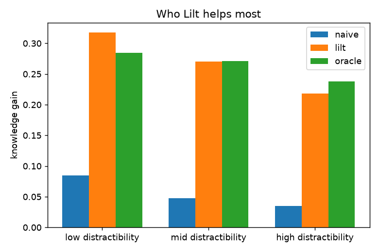
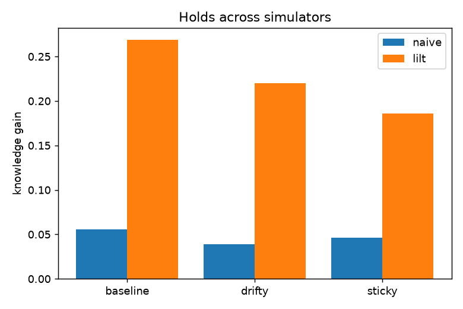

# Lilt

A middle-school math tutor that adapts to *why* a student is struggling, not just whether they got the last answer right.

Most adaptive tutors track one thing: does the student know this skill. When an answer is wrong, they lower the estimated ability and serve easier, slower content. For a student who is capable but distractible, that is the wrong move. A wrong answer usually means the student drifted off or got frustrated, not that they cannot do it, and easier content just bores them further. The tutor's well-meant adaptation makes the real problem worse.

Lilt models three things at once instead of one: how well the student knows the skill, how engaged they are right now, and how frustrated they are. It tells those apart from the timing and pattern of answers, intervenes on the actual cause (ease and encourage when frustrated, re-engage or switch when drifting, advance when genuinely mastered), and holds back from marking a student as "behind" when the cause of a wrong answer is genuinely unclear.

The motivation is personal: my younger sister, who is sharp but loses focus fast, and whose grades have never reflected what she can actually do.

## Status

The engine and its honest evaluation are built and tested (simulation-first, the same approach I used for MedMaps and Cairn). Next is a real browser app for middle-school math. See [docs/DESIGN.md](docs/DESIGN.md) for the full design and the staged build plan.

## What the evaluation shows

Each tutor drives its own copy of the same simulated student (matched seed), so the only thing that differs is which problems it chose. The metric is the gain in the student's true latent knowledge, measured from the simulator, never in-session accuracy, so a tutor cannot look good by serving easy problems.

- **Against a correctness-only tutor.** On grade 6, Lilt produced a knowledge gain of about 0.27 versus about 0.06 for the naive tutor, roughly five times as much, and matched an oracle that sees the student's true hidden state (about 0.26). The belief filter is, in this study, about as good as knowing the truth.
- **It holds when the model is wrong.** The comparison runs across three simulator "worlds" whose dynamics deliberately break the tracer's assumptions (attention that fades faster, frustration that lingers). Lilt beats the naive tutor in all three, so the win is not an artefact of the model matching the simulator.
- **Who it helps.** Lilt helps every group, but the most distractible students are the hardest to teach for any tutor, so its absolute advantage is not largest there. I expected the opposite and the data did not support it, so this is stated plainly rather than dressed up.

  

- **What drives the gain, reported straight.** An ablation turns each piece off in turn. Almost all of the gain comes from managing attention: removing the break collapses Lilt back to the naive level. Switching for novelty helps a little. Easing on frustration and the explicit "abstain" action are near-zero on this metric, because the protection against mislabeling a capable student as behind already lives in the belief filter (it resists dropping mastery on a fast miss), so the separate abstain step is mostly redundant on a pure knowledge-gain measure. Its value is in not telling a capable student she is behind, which this metric does not capture.

  

Reproduce with `python -m lilt.eval.study`.

## What it deliberately does not do

These are evidence-based decisions, not missing features (citations in the design doc):

- No "learning styles." Matching instruction to a visual/auditory/kinesthetic preference does not improve learning, and the labels lower expectations for the kids they get pinned on.
- No points/badges/leaderboard economy. Heavy external rewards undermine intrinsic motivation, most of all for children and on tasks they could find interesting. Lilt makes progress visible and gives feedback on the work itself.
- No brain-training claims. Lilt adapts the math content to the student; it is not a working-memory game, which the evidence shows does not transfer to real academics.

## Run it

```bash
pip install -e ".[dev]"
pytest
```

## License

MIT
